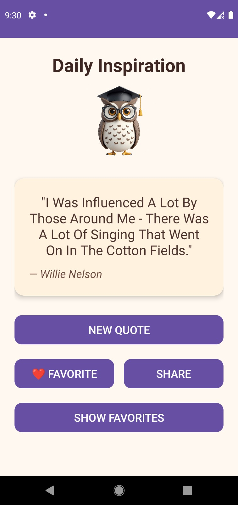
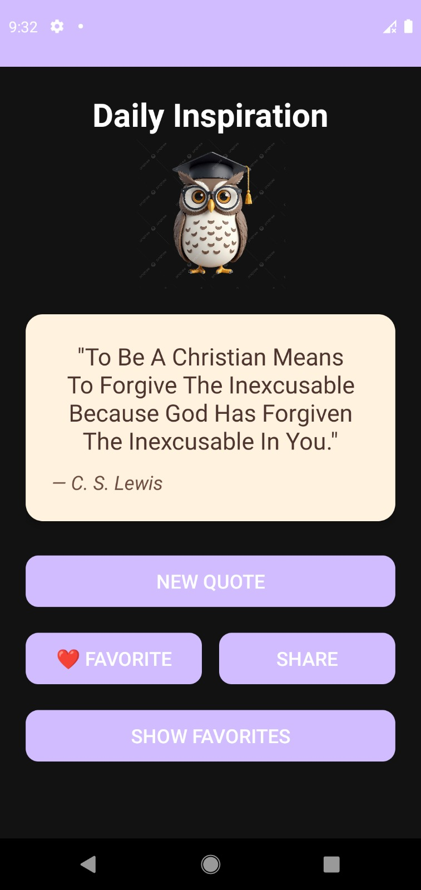
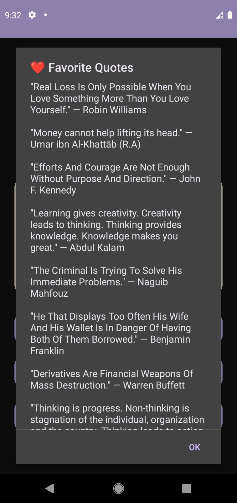
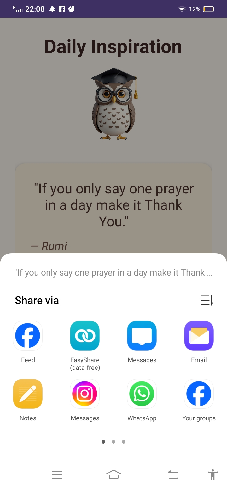
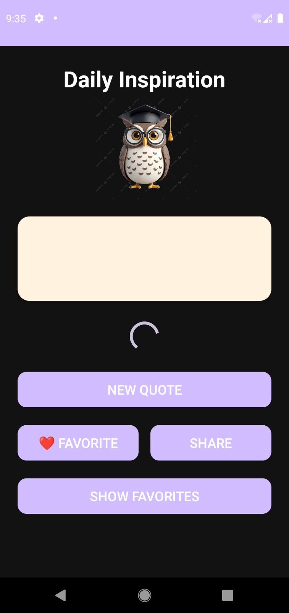

# 📖 Daily Quotes App (Android – Kotlin)

A simple and elegant **Daily Quotes Android application** built using **Kotlin** in **Android Studio**.  
The app delivers inspirational quotes daily, allows users to favorite and share quotes, and works even when the user is offline.

---

## ✨ Features

- 📅 **Daily Quotes** – Get a fresh quote every day
- ❤️ **Favorite Quotes** – Save quotes you love
- 📂 **View Favorites** – Access all saved favorite quotes in one place
- 🔁 **Offline Support** – Stores up to **20 previously fetched quotes** using SharedPreferences
- 📤 **Share Quotes** – Share quotes via WhatsApp, Instagram, email, etc.
- 🌗 **Light & Dark Theme Support**
- ⏳ **Loading Indicator** – Shows progress while fetching quotes
- 🌐 **API Integration** – Uses **DummyJSON Quotes API**

---

## 🛠️ Tech Stack

- **Language:** Kotlin  
- **IDE:** Android Studio  
- **API:** [DummyJSON Quotes API](https://dummyjson.com/quotes)  
- **Networking:** Retrofit  
- **Storage:** SharedPreferences  
- **UI:** XML Layouts  
- **Architecture:** Activity-based (can be extended to MVVM)

---

## 📱 Screenshots

| Home Screen | Dark Mode |
|------------|---------------|
|  |   |

| Favorites List | Share Quote  |
|----------|---------------|
|  |  |

| Loading Indicator| Add to Favorites|
|------------|-----------|
|  |  |

> 📌 **Note:** Add your screenshots inside a `screenshots/` folder and update file names if needed.

---

##🚀 How to Run the Project

-Clone the repository:

```

git clone https://github.com/Khadija-Saeed08/Daily-Quotes-App.git

```


- Open the project in Android Studio

- Sync Gradle files

- Run the app on an emulator or physical device 📱

